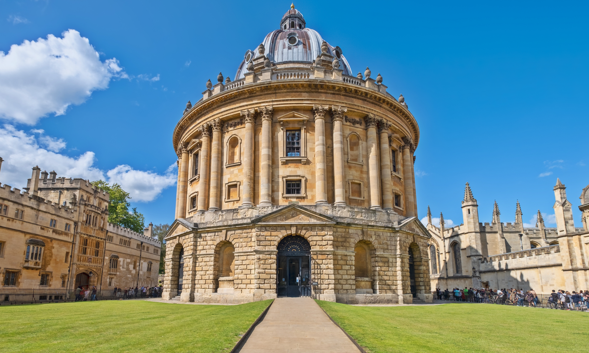
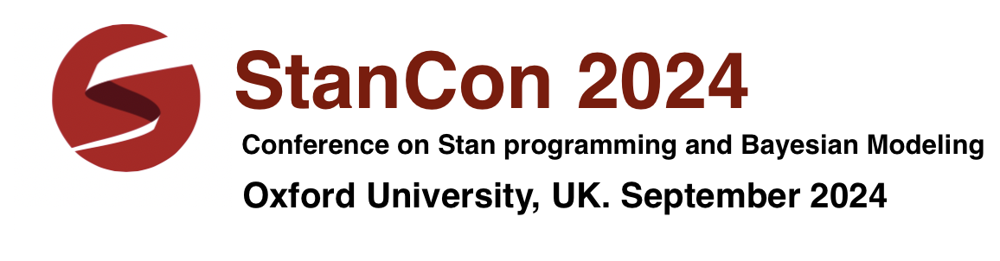
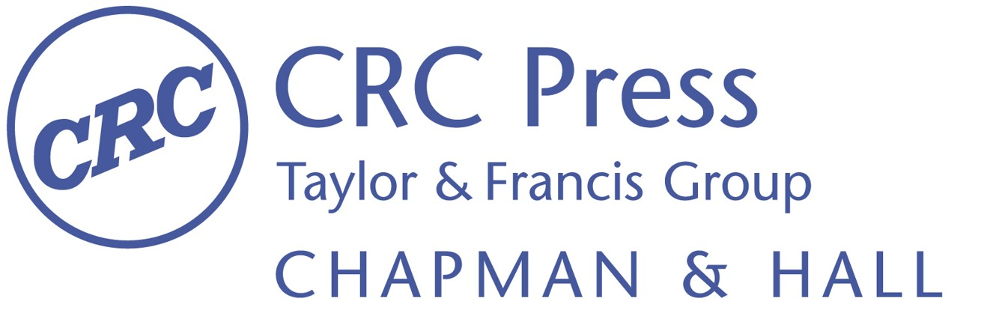

 

 

------
Dates: September 10 - 12th 2024

Information regarding travelling and accomodation, and applications for scholarships will be posted soon!

------
**Sponsors**

Sponsors support StanCon in various ways and help us book venues, create high quality online content, provide scholarships for early career researchers and participants from underrepresented groups in the sciences, and more.

If you're interested in sponsoring StanCon, please email [board@mc-stan.org](mailto:board@mc-stan.org).

We thank our current sponsors and supporting institutions: Metrum Research Group, Taylor and Francis, NumFocus, and the University of Oxford.

------
- [**Keynote speakers**](#keynote-speakers)
- [**Call for proposals**](#call-for-proposals)
- [**Registration**](#registration)
- [**Scholarships**](#scholarships)
- [**Lodging**](#lodging)
- [**Organizers**](#organizers)

------

------
# [Keynote speakers](#keynote-speakers)

These are the confirmed keynote speakers:

* Chris Wymant (Senior Researcher, Pandemic Sciences Institute, Oxford University)
* Mitzi Morris (Stan Developer, Columbia University)
* Vianey Leos Barajas (Assistant Professor, Department of Statistical Sciences & School of the Environment, University of Toronto)
* Sebastian Weber (Director Statistical Methods & Consulting, Advanced Exploratory Analytics, Novartis Pharma AG, Basel)

Talk titles and abstracts will be posted soon!

------
# [Call for proposals](#call-for-proposals)

We're now accepting proposals for contributed talks and tutorials. Proposals are reviewed by the organization committee on a rolling basis.

Contributed talks are 15 minutes long, with an additional 5 minutes for questions. Talks can cover a diversity of topics, including:
* Data analysis and modeling using Stan in any field
* Software development within Stan or the Stan ecosystem, and more broadly software relevant to Stan users
* Methodological development for Bayesian modeling

To submit a proposal for a talk, please fill out this [form](https://docs.google.com/forms/d/e/1FAIpQLSecIfstHZUqdGEyQEaeMNW9gwuM97ofD3iWmFPJnoe11iHEvw/viewform). 

Tutorials are either half-a-day or one day long, with each half-day 2 or 3 hours long. Tutorials should be introductory, though certain pre-requisites may be assumed (e.g. basic knowledge of Stan, R, Python, probability, etc.). When submitting a proposal be specific about the pre-requisites.

We will provide an "introduction to Stan" tutorial, aimed at participants who have not used Stan before.

To submit a proposal for a tutorial, please fill out this [form](https://docs.google.com/forms/d/e/1FAIpQLScTJJDpSFArDcrdyD8Hrd_ImnUvYLvmHGc-Ci6Om3AJx5ryzg/viewform).

------
# [Registration](#registration)

Tickets can be purchased at [link](https://www.tickettailor.com/events/standevelopmentteam/1182660).

Prices for early bird registration are listed below:
* Students (Conference only) £199.0
* Students (Conference and tutorials) £299.0
* Academics (Conference only) £299.0
* Academics (Conference and tutorials) £449.0
* Industry (Conference only) £599.0
* Industry (Conference and tutorials) £799.0

After July 1st, all ticket prices for non-student participants increase by £100.0 (prices for students will not increase).

------
# [Scholarships](#sholarships)

The purpose of the StanCon scholarship is to make StanCon a more accessible and inclusive event.

Participants who require financial assistance to attend the conference should fill out an [application form](https://docs.google.com/forms/d/e/1FAIpQLSffo0TumZ4ndFJulzyBtHifh3bfz05IvjWQNBwtdHtrxSb5XA/viewform?ts=65b6a720). 

The StanCon scholarship covers registration for the tutorial and the main conference, as well as local lodging. Scholarships are awarded on a need-base, and prioritize early career scientists, including students and post-docs, and members of underrepresented groups in STEM.

Applications are accepted and reviewed on a rolling basis, and scholarships are awarded based on available funds.

------
# [Lodging](#lodging)

Information regarding lodging will be posted soon!

# [Organizers](#organizers)

- Michael Collyer (University of Oxford)
- Joss Wright (University of Oxford)
- Richard McElreath (Max Planck Institute for Evolutionary Anthropology)
- Elizaveta Semenova (Imperial College London)
- Ben Lambert (University of Oxford)
- Seth Flaxman (University of Oxford)
- Charles Margossian (Flatiron Institute)
- Juliette Unwin (University of Bristol)
- Will Pearse (Imperial College London)
- Makkunda Sharma (University of Oxford)
